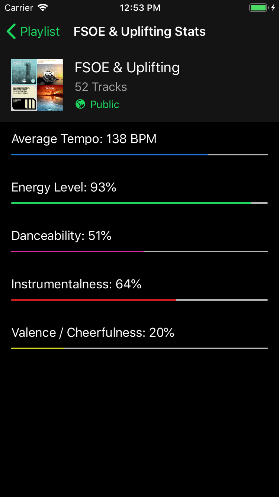
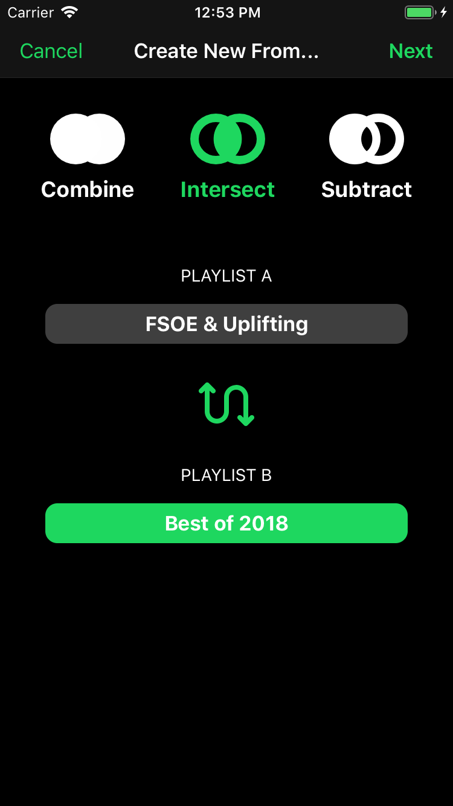
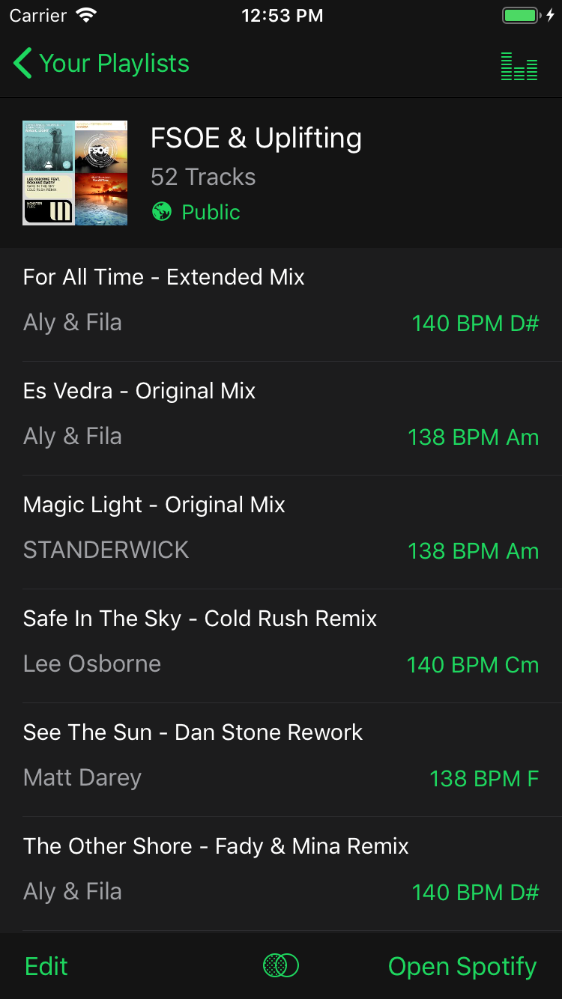
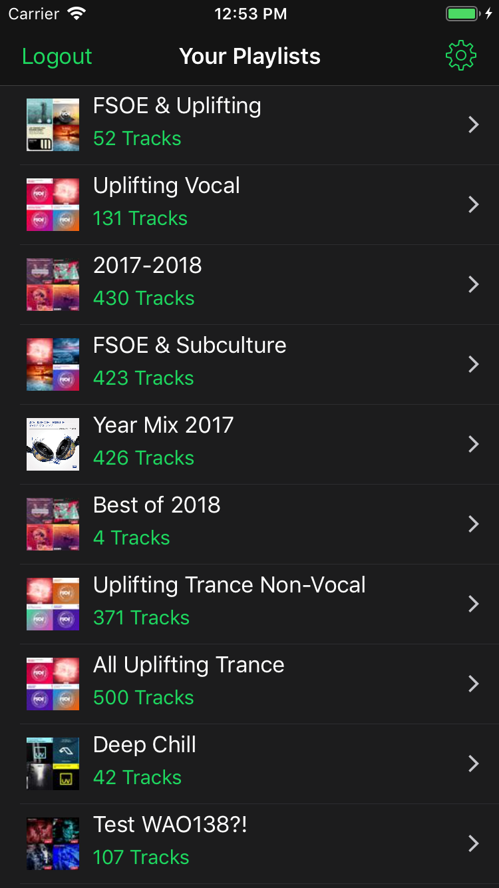

# 1811_SeymourBailey

## Fuse for Spotify

Fuse for Spotify allows you to create great Spotify playlists by offering features like the ability to combine, intersect, and subtract playlists from each other. Fuse also displays comprehensive statistics and insights that are not available in the official Spotify app such as tempo, song key, energy-level, instrumentalness, valence, and danceability. 

*** FEATURES *** 

- Connects with your Spotify account 

- Create Playlists Easily
  - Combine all songs in two playlists
  - Delete songs from one playlist in another (Subtraction)
  - Find songs that only exist in both playlists (Intersection) 

- Find out how your playlists sound (statistically speaking)
  - Energy level, average tempo (BPM), instrumentalness, valence, and danceability 

- Modify playlists to put similar tracks together
- View the tempo and song key of your tracks inline
- Edit/Rearrange tracks in your playlists 

### Installation:

1. Open the .xcworkspace file with Xcode
2. Ensure breakpoints are disabled under Debug->Deactivate Breakpoints in Xcode
3. Run the Xcode project on an iOS device or by using the iOS simulator.

### Known Issues

None currently

### Additional Notes

There may also be warnings inside of third-party libraries.

### Screen Shots

